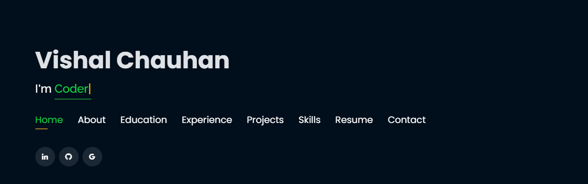
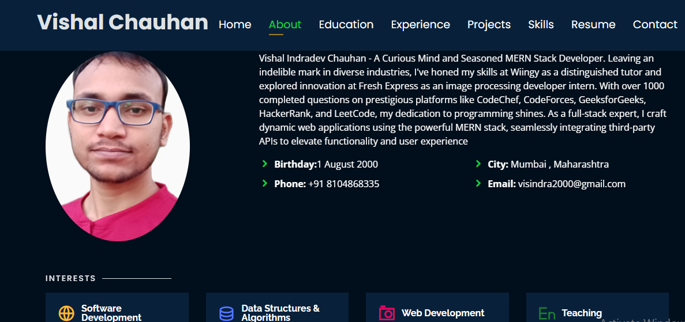
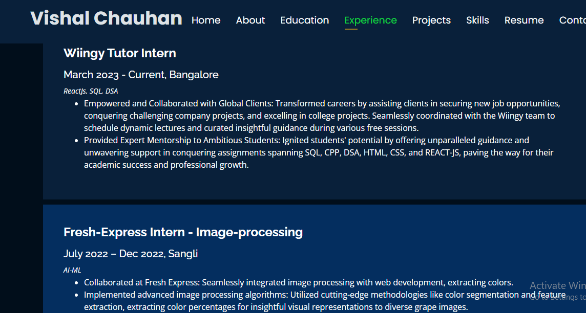

# Personal Portfolio 🔥

https://github.com/micklevast

### Website Preview

#### Home Page

#### About Page

#### Projects Page

## Sections 📚

✔️ About
✔️ Interests
✔️ Education
✔️ Online Certification
✔️ Experience
✔️ Projects
✔️ Skills
✔️ Resume
✔️ Contact Info

## Tools Used 🛠️

* `<b>`GitHub Pages `</b>` - To host my static website (HTML, CSS, JS).-
